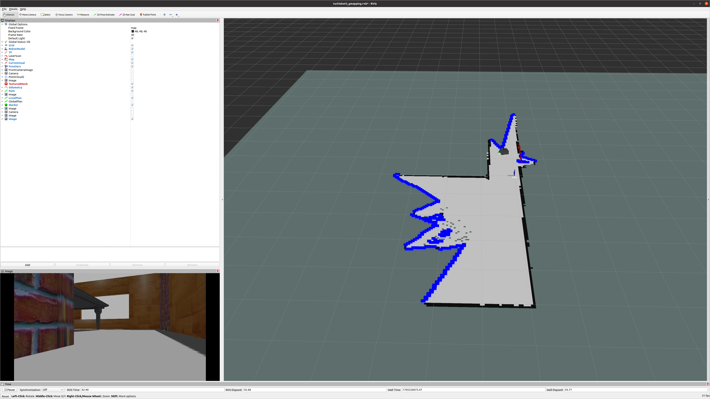

# frontier_exploration

Thread safe frontier exploration package based on fast and efficient Wavefront Frontier Detection.

## Resolving dependencies

Use `rosdep` to resolve ROS dependencies

## Set up

- clone this repository into your catkin workspace

```bash
git clone https://github.com/kotakondo/frontier_exploration.git
```
 
- install dependence ros packages (ref: https://emanual.robotis.com/docs/en/platform/turtlebot3/quick-start/)

```bash
sudo apt-get install ros-noetic-joy ros-noetic-teleop-twist-joy \
ros-noetic-teleop-twist-keyboard ros-noetic-laser-proc \
ros-noetic-rgbd-launch ros-noetic-rosserial-arduino \
ros-noetic-rosserial-python ros-noetic-rosserial-client \
ros-noetic-rosserial-msgs ros-noetic-amcl ros-noetic-map-server \
ros-noetic-move-base ros-noetic-urdf ros-noetic-xacro \
ros-noetic-compressed-image-transport ros-noetic-rqt* ros-noetic-rviz \
ros-noetic-gmapping ros-noetic-navigation ros-noetic-interactive-markers
```

- install turtlebot3 packages (ref: https://emanual.robotis.com/docs/en/platform/turtlebot3/quick-start/)

```bash
sudo apt install ros-noetic-dynamixel-sdk
sudo apt install ros-noetic-turtlebot3-msgs
sudo apt install ros-noetic-turtlebot
```

- install simulation package in `src` folder (ref: https://emanual.robotis.com/docs/en/platform/turtlebot3/simulation/)

```bash
git clone -b noetic-devel https://github.com/ROBOTIS-GIT/turtlebot3_simulations.git
```

- install turtlebot3, navigation, realsense-ros, realsense_gazebo_plugin packages in `src` folder

```bash
git clone https://github.com/kotakondo/turtlebot3.git
git clone https://github.com/kotakondo/navigation.git
git clone https://github.com/kotakondo/realsense-ros.git
git clone https://github.com/pal-robotics/realsense_gazebo_plugin.git
```

- set up turtlebot3 model (ref: https://emanual.robotis.com/docs/en/platform/turtlebot3/simulation/)

-- waffle (with camera - recommended)

```bash
echo "export TURTLEBOT3_MODEL=waffle" >> ~/.bashrc
```

<details>
<summary>Other models</summary> 

-- burger (no camera)

```bash
echo "export TURTLEBOT3_MODEL=burger" >> ~/.bashrc
```

or 

-- waffle_pi (with camera)

```bash
echo "export TURTLEBOT3_MODEL=waffle_pi" >> ~/.bashrc
```

</details>

- build

```bash
source ~/.bashrc
```

## Demo using Turtlebot3

```bash
tmuxp load tmux/sim.yaml
```

You will see the following screen.



### for Kimera Semantics
```bash
sudo apt-get install ros-noetic-stereo-msgs
sudo apt-get install ros-noetic-tf-conversions
```